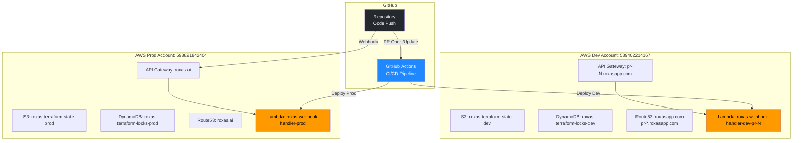

# Roxas

**Transform git commits into professional LinkedIn posts**

Roxas is an open-source automation service that helps OSS projects reach decision-makers and secure funding by automatically converting git commits into engaging LinkedIn posts with AI-generated summaries and professional images.

## 🚀 Status

✅ **Production Ready** - Deployed and operational in multi-environment AWS infrastructure

- **Environments**: Development (PR testing) + Production (main branch)
- **CI/CD**: Fully automated deployment pipeline
- **Test Coverage**: 61 tests passing (unit + integration + E2E)
- **Infrastructure**: AWS Lambda + API Gateway + Terraform

## Architecture

### System Flow


### Component Architecture


### Infrastructure

**AWS Architecture (Per Environment):**

```mermaid
graph TB
    subgraph "External"
        GitHub[GitHub Webhook<br/>POST /webhook]
        Client[External Client<br/>HTTPS Request]
    end

    subgraph "Route 53"
        R53_Prod[roxas.ai<br/>A Record]
        R53_Dev[pr-N.roxasapp.com<br/>A Record]
        HostedZone_Prod[Hosted Zone<br/>roxas.ai]
        HostedZone_Dev[Hosted Zone<br/>roxasapp.com]

        R53_Prod -.-> HostedZone_Prod
        R53_Dev -.-> HostedZone_Dev
    end

    subgraph "ACM - Certificate Manager"
        ACM_Prod[SSL Certificate<br/>roxas.ai]
        ACM_Dev[SSL Certificate<br/>*.roxasapp.com]
        Validation_Prod[DNS Validation<br/>CNAME Records]
        Validation_Dev[DNS Validation<br/>CNAME Records]

        ACM_Prod -.-> Validation_Prod
        ACM_Dev -.-> Validation_Dev
        Validation_Prod -.-> HostedZone_Prod
        Validation_Dev -.-> HostedZone_Dev
    end

    subgraph "API Gateway v2"
        CustomDomain_Prod[Custom Domain<br/>roxas.ai]
        CustomDomain_Dev[Custom Domain<br/>pr-N.roxasapp.com]
        API[HTTP API<br/>roxas-webhook-handler]
        Stage[Stage: $default<br/>Auto-deploy enabled]
        Integration[Lambda Integration<br/>AWS_PROXY]
        Route[Route: POST /webhook]
        APILogs[CloudWatch Log Group<br/>/aws/apigateway/...]

        CustomDomain_Prod --> API
        CustomDomain_Dev --> API
        API --> Stage
        Stage --> Route
        Route --> Integration
        Stage -.Logs.-> APILogs
    end

    subgraph "Lambda"
        Function[Lambda Function<br/>roxas-webhook-handler<br/>Runtime: Go 1.x custom<br/>Memory: 256MB<br/>Timeout: 60s]
        LambdaRole[IAM Role<br/>Lambda Execution Role]
        LambdaPolicy[IAM Policy<br/>AWSLambdaBasicExecutionRole]
        Permission[Lambda Permission<br/>AllowAPIGatewayInvoke]
        LambdaLogs[CloudWatch Log Group<br/>/aws/lambda/roxas-webhook-handler<br/>Retention: 7 days]
        EnvVars[Environment Variables<br/>OPENAI_API_KEY<br/>LINKEDIN_ACCESS_TOKEN<br/>WEBHOOK_SECRET<br/>LOG_LEVEL]

        Function --> LambdaRole
        LambdaRole --> LambdaPolicy
        Function -.Logs.-> LambdaLogs
        Function -.Config.-> EnvVars
        Integration --> Permission
        Permission --> Function
    end

    subgraph "External APIs"
        OpenAI[OpenAI API<br/>GPT-4 + DALL-E]
        LinkedIn[LinkedIn API<br/>Posts & Media Upload]
    end

    subgraph "Terraform State"
        S3_State[S3 Bucket<br/>roxas-terraform-state-{env}<br/>Versioning enabled]
        DynamoDB_Lock[DynamoDB Table<br/>roxas-terraform-locks-{env}<br/>Locking for state]
    end

    Client --> R53_Prod
    Client --> R53_Dev
    GitHub --> R53_Prod
    R53_Prod --> CustomDomain_Prod
    R53_Dev --> CustomDomain_Dev
    CustomDomain_Prod -.Certificate.-> ACM_Prod
    CustomDomain_Dev -.Certificate.-> ACM_Dev
    Function --> OpenAI
    Function --> LinkedIn

    style GitHub fill:#24292e,color:#fff
    style Function fill:#ff9900,color:#000
    style API fill:#ff4f8b,color:#fff
    style OpenAI fill:#10a37f,color:#fff
    style LinkedIn fill:#0077b5,color:#fff
    style S3_State fill:#569a31,color:#fff
    style DynamoDB_Lock fill:#4053d6,color:#fff
    style ACM_Prod fill:#dd344c,color:#fff
    style ACM_Dev fill:#dd344c,color:#fff
    style R53_Prod fill:#8c4fff,color:#fff
    style R53_Dev fill:#8c4fff,color:#fff
```

**Multi-Environment Overview:**



## Quick Start

### Prerequisites

- **Go 1.25.3+**
- **AWS Account** (for deployment)
- **API Keys**:
  - OpenAI API key (GPT-4 + DALL-E access)
  - LinkedIn API credentials (OAuth access token)
  - GitHub webhook secret

### Installation

```bash
# Clone repository
git clone git@github.com:michaellady/roxas.git
cd roxas

# Install dependencies
go mod download

# Copy environment template
cp .env.example .env

# Edit .env with your API keys
# See "Environment Variables" section below
```

### Local Development

```bash
# Run all tests
make test

# Run integration tests
make test-int

# Build Lambda deployment package
make build

# Clean build artifacts
make clean
```

## Development

### Project Structure

```
roxas/
├── cmd/
│   └── server/              # Lambda entry point
│       ├── main.go          # Handler initialization
│       └── main_test.go     # Lambda handler tests
├── internal/
│   ├── clients/             # External API clients
│   │   ├── openai.go        # OpenAI API client (GPT-4 + DALL-E)
│   │   ├── openai_test.go
│   │   ├── linkedin.go      # LinkedIn API client
│   │   └── linkedin_test.go
│   ├── handlers/            # HTTP request handlers
│   │   ├── webhook.go       # GitHub webhook handler
│   │   └── webhook_test.go
│   ├── models/              # Data structures
│   │   ├── commit.go        # Commit payload models
│   │   └── commit_test.go
│   ├── orchestrator/        # Workflow coordination
│   │   └── orchestrator.go  # End-to-end flow orchestration
│   └── services/            # Business logic
│       ├── summarizer.go    # GPT-4 commit summarization
│       ├── summarizer_test.go
│       ├── imagegen.go      # DALL-E image generation
│       ├── imagegen_test.go
│       ├── linkedin.go      # LinkedIn posting logic
│       └── linkedin_test.go
├── tests/
│   └── integration_test.go  # End-to-end integration tests
├── terraform/               # Infrastructure as Code
│   ├── main.tf              # AWS resources
│   ├── variables.tf         # Configuration variables
│   ├── outputs.tf           # Deployment outputs
│   ├── backend-dev.hcl      # Dev backend config
│   ├── backend-prod.hcl     # Prod backend config
│   ├── README.md            # Terraform documentation
│   └── BACKEND.md           # Backend setup guide
├── scripts/
│   ├── e2e-test.sh          # End-to-end test script
│   └── setup-terraform-backend.sh  # Backend initialization
├── .github/
│   └── workflows/
│       ├── test.yml         # Branch test workflow
│       ├── pr-deploy-dev.yml       # PR dev deployment
│       ├── pr-cleanup-dev.yml      # PR cleanup
│       └── main-deploy-prod.yml    # Production deployment
├── Makefile                 # Build and test commands
├── go.mod                   # Go dependencies
└── README.md                # This file
```

### Testing

```bash
# Unit tests (fast, no external APIs)
make test

# Integration tests (mocked external services)
make test-int

# System tests (requires real API credentials)
make test-system

# End-to-end test (requires deployed Lambda)
LAMBDA_URL=https://... WEBHOOK_SECRET=... make e2e
```

**Test Coverage:**
- **Unit tests**: 54 tests (handlers, services, clients)
- **Integration tests**: 7 tests (end-to-end flow)
- **Total**: 61 tests passing

### Development Workflow

1. **Create feature branch**: `git checkout -b feature-name`
2. **Write tests first** (TDD approach)
3. **Implement feature**
4. **Run tests**: `make test`
5. **Create PR** to `main`
6. **Automatic deployment**: PR → Dev environment, Merge → Prod

## Deployment

### CI/CD Pipeline

Roxas uses GitHub Actions for automated testing and deployment:


**Workflows:**

1. **`test.yml`** - Runs on every branch push
   - Executes unit and integration tests
   - Fast feedback loop (~30 seconds)

2. **`pr-deploy-dev.yml`** - Runs on PR open/update
   - Deploys to dev AWS account
   - Creates isolated workspace: `dev-pr-{PR_NUMBER}`
   - Runs E2E tests against dev deployment
   - Comments PR with webhook URL and test results

3. **`pr-cleanup-dev.yml`** - Runs on PR close
   - Destroys dev resources for the PR
   - Cleans up Terraform workspace

4. **`main-deploy-prod.yml`** - Runs on main branch push
   - Deploys to production AWS account
   - Single workspace: `prod`
   - Runs E2E tests to verify deployment
   - Production webhook URL available

### Environments

**Development Environment:**
- AWS Account: `539402214167`
- IAM User: `github-actions-ci`
- Terraform Backend: `roxas-terraform-state-dev`
- Function Naming: `roxas-webhook-handler-dev-pr-{NUMBER}`

**Production Environment:**
- AWS Account: `598821842404`
- IAM User: `github-actions-prod`
- Terraform Backend: `roxas-terraform-state-prod`
- Function Naming: `roxas-webhook-handler-prod`

### Manual Deployment

If you need to deploy manually (not recommended):

```bash
# Build deployment package
make build

# Deploy to AWS (requires AWS credentials)
cd terraform

# Initialize backend
terraform init -backend-config=backend-prod.hcl

# Select workspace
terraform workspace select prod || terraform workspace new prod

# Deploy
terraform apply
```

For detailed Terraform documentation, see [`terraform/README.md`](terraform/README.md).

## Environment Variables

### Required Variables

| Variable | Description | Example |
|----------|-------------|---------|
| `OPENAI_API_KEY` | OpenAI API key for GPT-4 and DALL-E | `sk-proj-...` |
| `LINKEDIN_ACCESS_TOKEN` | LinkedIn OAuth access token | `AQV...` |
| `WEBHOOK_SECRET` | GitHub webhook secret for signature validation | Random 32+ char string |

### Optional Variables

| Variable | Default | Description |
|----------|---------|-------------|
| `LOG_LEVEL` | `info` | Logging level (`debug`, `info`, `warn`, `error`) |
| `AWS_REGION` | `us-east-1` | AWS region (set by Lambda runtime) |
| `PORT` | `8080` | Local server port (not used in Lambda) |

### Setting Environment Variables

**Local Development:**
```bash
cp .env.example .env
# Edit .env with your values
```

**GitHub Actions (CI/CD):**
1. Go to repository Settings → Secrets and variables → Actions
2. Add secrets to appropriate environment (`dev` or `prod`):
   - `AWS_ACCESS_KEY_ID`
   - `AWS_SECRET_ACCESS_KEY`
   - `OPENAI_API_KEY`
   - `LINKEDIN_ACCESS_TOKEN`
   - `GITHUB_WEBHOOK_SECRET`

**AWS Lambda:**
- Environment variables are set via Terraform (`terraform/variables.tf`)
- Sensitive values pulled from GitHub Secrets during deployment

## API Reference

### Webhook Endpoint

**URL:** `POST /webhook`

**Headers:**
- `X-Hub-Signature-256`: GitHub webhook signature (HMAC SHA256)
- `X-GitHub-Event`: Event type (must be `push`)
- `Content-Type`: `application/json`

**Request Body:**
```json
{
  "ref": "refs/heads/main",
  "repository": {
    "name": "repo-name",
    "full_name": "owner/repo-name"
  },
  "commits": [
    {
      "id": "abc123...",
      "message": "Add new feature",
      "author": {
        "name": "Developer Name",
        "email": "dev@example.com"
      },
      "url": "https://github.com/owner/repo/commit/abc123"
    }
  ]
}
```

**Response Codes:**
- `200 OK`: Webhook processed successfully
- `400 Bad Request`: Invalid payload or missing signature
- `401 Unauthorized`: Invalid signature
- `500 Internal Server Error`: Processing failed

**Example:**
```bash
# Generate signature
PAYLOAD='{"ref":"refs/heads/main",...}'
SIGNATURE=$(echo -n "$PAYLOAD" | openssl dgst -sha256 -hmac "$WEBHOOK_SECRET" | sed 's/^.* //')

# Send webhook
curl -X POST https://your-api-gateway-url/webhook \
  -H "Content-Type: application/json" \
  -H "X-Hub-Signature-256: sha256=$SIGNATURE" \
  -H "X-GitHub-Event: push" \
  -d "$PAYLOAD"
```

## Troubleshooting

### Common Issues

**1. Tests failing with API errors**
- **Cause**: Missing or invalid API keys
- **Solution**: Verify `.env` file has correct `OPENAI_API_KEY` and `LINKEDIN_ACCESS_TOKEN`

**2. Webhook signature validation fails**
- **Cause**: Mismatched `WEBHOOK_SECRET` between GitHub and Lambda
- **Solution**: Ensure GitHub webhook secret matches Lambda environment variable

**3. Lambda deployment fails**
- **Cause**: Missing AWS credentials or insufficient IAM permissions
- **Solution**: Verify GitHub Secrets are set and IAM policies are attached

**4. LinkedIn post not appearing**
- **Cause**: Invalid access token or token expired
- **Solution**: Regenerate LinkedIn access token (90-day expiration)

**5. DALL-E image generation fails**
- **Cause**: OpenAI API quota exceeded or invalid prompt
- **Solution**: Check CloudWatch logs for error details, verify OpenAI billing

### Debugging

**View Lambda Logs:**
```bash
# AWS CLI
aws logs tail /aws/lambda/roxas-webhook-handler-prod --follow

# Or via AWS Console
# CloudWatch → Log Groups → /aws/lambda/roxas-webhook-handler-prod
```

**Test Webhook Locally:**
```bash
# Run unit tests with verbose output
go test -v ./internal/handlers/

# Test specific function
go test -v -run TestWebhookHandler ./internal/handlers/
```

**Check Deployment Status:**
```bash
# View GitHub Actions runs
# Repository → Actions tab

# Check Terraform state
cd terraform
terraform show
```

## Contributing

We welcome contributions! Here's how to get started:

1. **Fork the repository**
2. **Create a feature branch**: `git checkout -b feature/your-feature`
3. **Write tests** for your changes (TDD approach)
4. **Implement your feature**
5. **Ensure all tests pass**: `make test`
6. **Commit your changes**: Include issue ID in commit message
7. **Push to your fork**: `git push origin feature/your-feature`
8. **Create a Pull Request**

### Code Style

- Follow standard Go conventions (`gofmt`, `golint`)
- Write godoc comments for exported functions
- Maintain test coverage (aim for >80%)
- Keep functions focused and testable

### Testing Requirements

All PRs must:
- Pass all existing tests (`make test`)
- Include tests for new functionality
- Maintain or improve code coverage
- Pass E2E tests in dev environment

### PR Process

1. **Automatic checks run** (tests + dev deployment)
2. **E2E tests verify** functionality in dev
3. **Code review** by maintainers
4. **Merge to main** → automatic prod deployment

## License

TBD

---

**Built with Go, AWS Lambda, OpenAI GPT-4 & DALL-E, and LinkedIn API**

For questions or issues, please open a GitHub issue.
